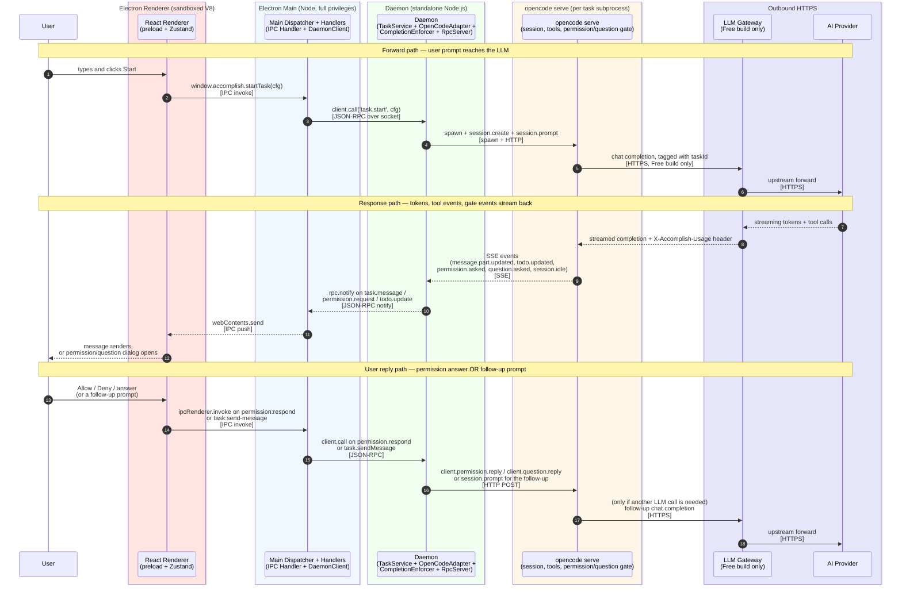
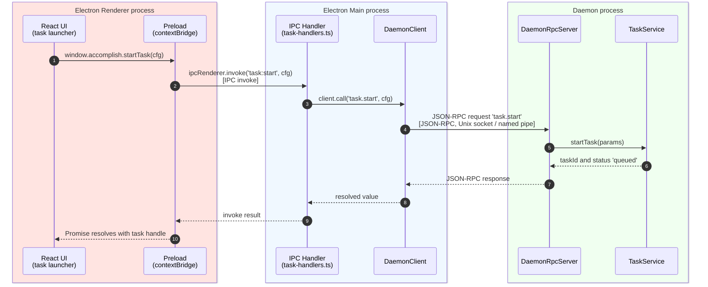
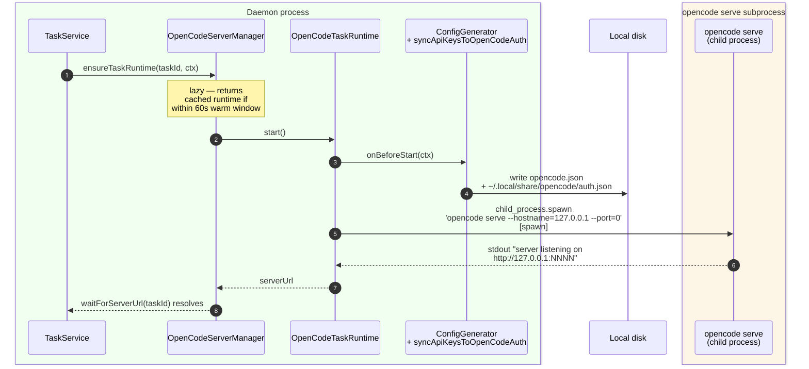
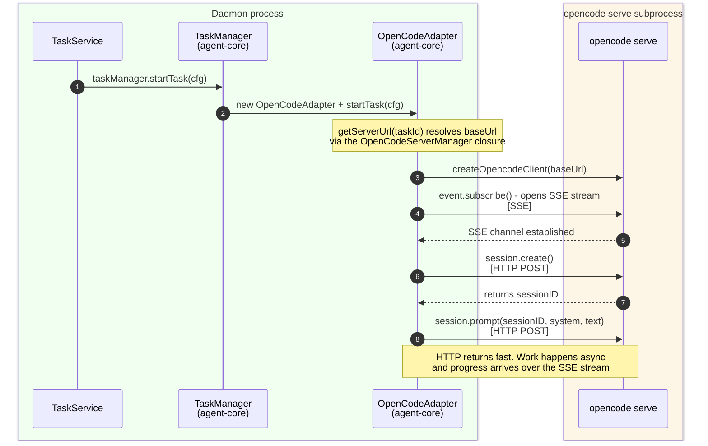
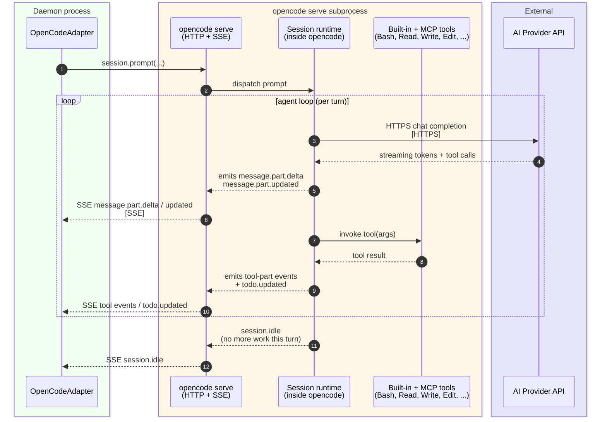
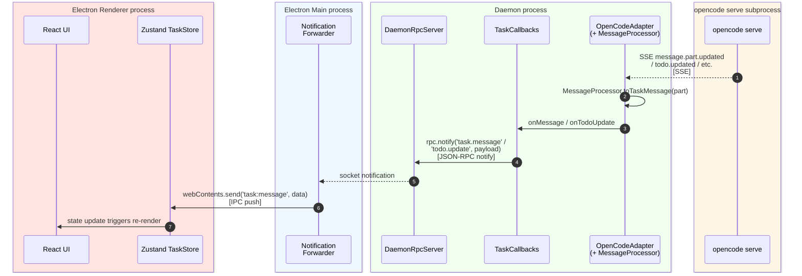
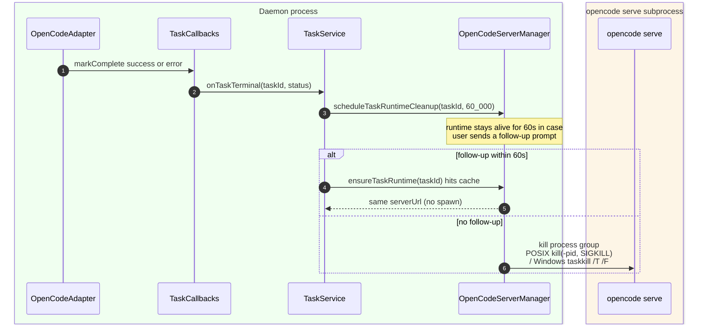
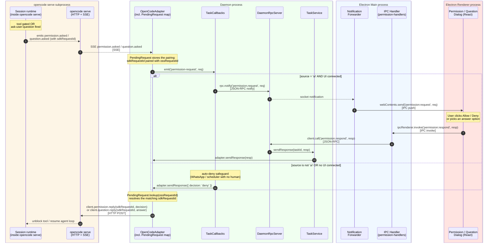
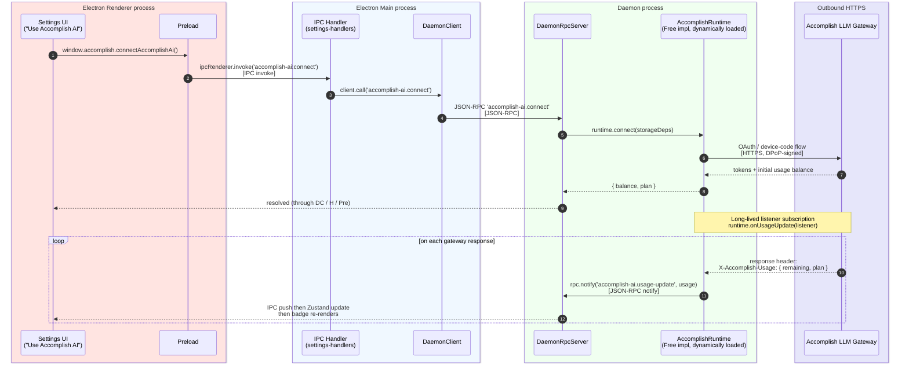
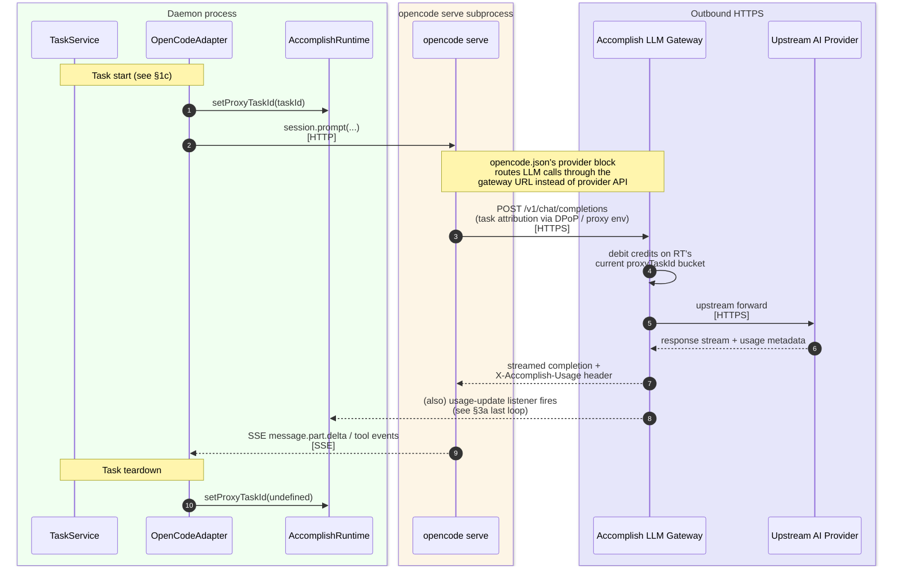

# Functional Sequence Diagrams — Accomplish Architecture

> **Companion to** [functional-viewpoint.md](functional-viewpoint.md). That document describes **what** each component is and **how** they connect at a structural level. This one shows **in what order** messages flow across those components, for the three flows where the message order is load-bearing: task start-up, human-in-the-loop gating, and the Free-build LLM-gateway integration.

Each diagram shows only the participants that are active in that phase — participants that only stage data (e.g., `ConfigGenerator`, `ProviderConfigBuilder`) are collapsed into one node so the wire-level interaction stays legible.

## Transport legend

| Annotation            | Mechanism                                                | Direction / shape                          |
| --------------------- | -------------------------------------------------------- | ------------------------------------------ |
| **[IPC invoke]**      | `ipcRenderer.invoke` ↔ `ipcMain.handle` (Electron IPC)   | Renderer → Main, request/reply             |
| **[IPC push]**        | `webContents.send` → `ipcRenderer.on`                    | Main → Renderer, one-way notify            |
| **[JSON-RPC]**        | JSON-RPC 2.0 over Unix socket / Windows named pipe       | Main ↔ Daemon, request/reply               |
| **[JSON-RPC notify]** | `rpc.notify(channel, payload)` on the same socket        | Daemon → Main, one-way                     |
| **[HTTP]**            | OpenCode SDK v2 REST call on `http://127.0.0.1:<random>` | Daemon → `opencode serve`, request/reply   |
| **[SSE]**             | Server-Sent Events stream on the same loopback port      | `opencode serve` → Daemon, streaming push  |
| **[HTTPS]**           | Outbound TLS                                             | `opencode serve` / gateway → external APIs |
| **[spawn]**           | `child_process.spawn`                                    | OS process creation (not a wire protocol)  |

There is **no WebSocket anywhere** in the system — the SDK event channel is SSE, not WS.

---

## Bird's-eye view — one diagram, every process

This single diagram shows the whole system in flight — every OS process, every wire between them, and the three paths you need to recognise: **forward** (user → LLM), **response** (LLM → user), and **user reply** (user answers a permission or sends a follow-up). Each box below is a distinct OS process (or external endpoint); participants inside the same box share the same address space. §1, §2, and §3 expand every hop.

**How to read the boxes:**

| Box                       | What lives here                                                                                            | How it talks outward                                                 |
| ------------------------- | ---------------------------------------------------------------------------------------------------------- | -------------------------------------------------------------------- |
| Electron Renderer         | React UI, Zustand store, preload (`contextBridge`)                                                         | Only through the preload bridge to Main — no network, no `fs`        |
| Electron Main             | IPC handlers, `DaemonClient`, notification forwarder, OAuth popups, tray                                   | IPC to Renderer; JSON-RPC over socket to Daemon                      |
| Daemon                    | `TaskService`, `OpenCodeAdapter`, `CompletionEnforcer`, `OpenCodeServerManager`, `DaemonRpcServer`, SQLite | JSON-RPC socket to Main; spawns + HTTP/SSE to `opencode serve`       |
| `opencode serve` per task | Session, agent loop, built-in tools, MCP tools, native permission/question gate                            | HTTPS outbound to Gateway or provider; HTTP + SSE back to Daemon     |
| Outbound HTTPS            | Accomplish LLM Gateway (Free only) and the AI provider                                                     | LLM Gateway proxies, tags per-task, and forwards to the actual model |

> **Note on terminology:** in the PTY era the gate shown inside `opencode serve` was an MCP server Accomplish shipped (`file-permission`, `ask-user-question`). In the SDK era it is native OpenCode functionality emitting `permission.asked` / `question.asked` events over the same SSE channel — no MCP server on that hop.

The per-hop breakdowns are in §1 (task start), §2 (permission/question gate), and §3 (LLM Gateway internals).

---

## 1. Task start — six phases

A single user action ("run this task") walks six distinct layers — UI/preload, daemon RPC, server pool, SDK adapter, the agent loop itself, and the event fan-out back to the UI. Each phase gets its own diagram so the participant list stays short and the transport shift between phases stays obvious.

### 1a. UI → Daemon (renderer prompt hits JSON-RPC surface)

**What this phase does:** converts a UI click into a daemon-side `TaskService.startTask` call, nothing more. No `opencode serve` yet, no LLM. The renderer is guaranteed a `taskId` it can start subscribing events for.

### 1b. Daemon spawns `opencode serve` for this task

**What this phase does:** lazily starts a per-task `opencode serve` HTTP+SSE server on a random loopback port. The runtime reads its provider credentials and session config from the two files `ConfigGenerator` just wrote — not from env vars.

### 1c. Agent-core adapter wires to the server

**What this phase does:** the SDK client inside `OpenCodeAdapter` opens the event stream **before** kicking off the first prompt, so nothing is missed. This is the first point in the lifecycle where HTTP and SSE are both live.

### 1d. Execution — `opencode serve` drives tools and the LLM

**What this phase does:** everything inside the opencode serve process. Accomplish is a passive observer on the SSE side — it never drives the LLM or the tool calls directly, it just reacts to events.

### 1e. Event fan-out — SSE event to React state

Participants are drawn right-to-left here because the data is flowing _outward_ from the daemon back to the UI — mirroring the direction reversal after §1a–1d went left-to-right.

**What this phase does:** translates low-level SDK events into `TaskMessage` shapes the renderer understands, and pushes them into the Zustand store. This is the "typing animation" path users see in the execution page.

### 1f. Teardown & warm-reuse

**What this phase does:** keeps the hot-path cost of follow-up prompts near zero while still reclaiming resources when conversations go idle.

---

## 2. Permission & Question gating

Triggered when the agent wants to run a file-mutating tool (`Write`, `Edit`, `Bash`) or explicitly asks the user a clarifying question via `ask-user-question`. The round-trip crosses every layer in the system and back.

**Key points:**

- **Two IDs, one mapping.** The OSS request ID is what the UI sees. The SDK request ID is what `opencode serve` expects on the reply. `PendingRequest` is the only place both IDs coexist.
- **Reply transport is HTTP, not SSE.** The subscription stream is strictly inbound (`opencode serve → adapter`). Replies go out over the ordinary SDK HTTP methods.
- **Auto-deny is on the same wire.** For non-UI sources (WhatsApp inbound, scheduler-fired task), `TaskCallbacks` invokes `adapter.sendResponse({ decision: 'deny' })` directly — the reply still traverses the same `PendingRequest` → HTTP path, it just skips the RPC/IPC/UI hop.
- **No `:9226` / `:9227` shims.** The HTTP callback servers the PTY era used are gone; the entire gate rides on the SDK's native event model.

---

## 3. LLM-Gateway integration (Free build)

The private package `@accomplish/llm-gateway-client` is loaded via dynamic `import()` at daemon startup. In OSS builds the import fails and `noopRuntime` takes over — every call below becomes a no-op except for `isAvailable()` returning `false`. The two diagrams below only make sense in a Free build.

### 3a. Connect / usage reporting (user-driven)

**What this phase does:** the UI opens a device-code / browser flow, exchanges it for credits, and then keeps a live usage counter in sync. `onUsageUpdate` is wired at daemon boot regardless of whether the user is currently looking at Settings — that way any task-driven gateway call refreshes the number silently.

### 3b. Per-task LLM call tagging (hot path)

**Key points:**

- **Where the taskId is injected.** `setProxyTaskId` is the single hot-path call between OSS code and the private runtime. It runs at `OpenCodeAdapter.startTask` and again (with `undefined`) at `teardown`. Every gateway-bound LLM request in between gets attributed to that task.
- **OpenCode doesn't know about the gateway.** From `opencode serve`'s point of view it is calling a normal provider endpoint — the swap happens inside the provider config that `buildAccomplishAiConfig` emits. That's why the integration survives OpenCode SDK upgrades without changes.
- **Two usage signal paths.** The response header feeds the in-UI balance; the gateway's own accounting tracks per-task credit spend for rate-limiting and abuse detection.
- **OSS parity.** In the OSS build `setProxyTaskId` is `undefined` (optional-chain short-circuits), `buildAccomplishAiConfig` returns empty, and `accomplish-ai.*` RPCs throw `accomplish_runtime_unavailable`. None of these diagrams' Free-specific arrows fire.

---

## 4. Ports & external services

The two tables below enumerate every wire that leaves a process. **Every port we open is bound to `127.0.0.1`** — no service in this document is reachable from the network. The "What it does" column is the short version; hop details live in §1–§3.

### 4.1 Local ports Accomplish opens

| Port     | What it does                                                                                                | Caller → Listener                    | Protocol                               | Status |
| -------- | ----------------------------------------------------------------------------------------------------------- | ------------------------------------ | -------------------------------------- | ------ |
| **9224** | Dev-browser MCP tool surface — exposes Playwright-driven browser automation to the agent                    | `opencode serve` → Playwright bridge | HTTP                                   | live   |
| **9225** | Chrome DevTools Protocol for the Playwright-controlled Chromium                                             | Playwright bridge → Chromium         | WebSocket (CDP)                        | live   |
| **9228** | Azure Foundry transform proxy — rewrites request bodies and rotates Azure AD tokens before upstream forward | `opencode serve` → daemon proxy      | HTTP                                   | live   |
| **9229** | Moonshot transform proxy — normalises Moonshot's non-standard auth and caching before upstream forward      | `opencode serve` → daemon proxy      | HTTP                                   | live   |
| **9230** | WhatsApp send API — Bearer-auth endpoint the `whatsapp-send` MCP tool POSTs messages to                     | `opencode serve` → daemon            | HTTP                                   | live   |
| random   | Per-task `opencode serve` — the SDK v2 REST + SSE endpoint for one task's session, tools, and LLM loop      | daemon → `opencode serve` child      | HTTP + SSE                             | live   |
| random   | OAuth callback — catches the redirect at the end of an MCP-connector or provider OAuth flow                 | user's browser → Electron Main       | HTTP                                   | live   |
| socket   | Daemon JSON-RPC — every Electron ↔ Daemon call (task lifecycle, settings, permissions, usage)               | Electron Main ↔ Daemon               | JSON-RPC over Unix socket / named pipe | live   |

### 4.2 External HTTPS endpoints (outbound only)

All calls are outbound HTTPS. Credentials are loaded from `SecureStorage` (AES-256-GCM) at task start.

| Service                      | Host                                                    | What it does for us                                                          | Who calls it                                                   |
| ---------------------------- | ------------------------------------------------------- | ---------------------------------------------------------------------------- | -------------------------------------------------------------- |
| Anthropic                    | `api.anthropic.com`                                     | LLM generation + Summarizer task-title generation                            | `opencode serve` / daemon Summarizer                           |
| OpenAI                       | `api.openai.com`                                        | LLM generation + ChatGPT OAuth flow for Pro/Plus accounts                    | `opencode serve` / Summarizer / `OpenAiOauthManager`           |
| Google Gemini                | `generativelanguage.googleapis.com`                     | LLM generation + Summarizer                                                  | `opencode serve` / Summarizer                                  |
| Google Vertex AI             | `*-aiplatform.googleapis.com`                           | Gemini via GCP IAM (for enterprise GCP users)                                | `opencode serve`                                               |
| Moonshot AI                  | `api.moonshot.ai` (via local `:9229` proxy)             | Kimi LLM models                                                              | local proxy → Moonshot                                         |
| Azure Foundry / Azure OpenAI | `cognitiveservices.azure.com` (via local `:9228` proxy) | Azure-hosted OpenAI models with Azure AD auth                                | local proxy → Azure                                            |
| AWS Bedrock                  | `bedrock-runtime.<region>.amazonaws.com`                | Anthropic and others via AWS IAM (for enterprise AWS users)                  | `opencode serve`                                               |
| ElevenLabs STT               | `api.elevenlabs.io`                                     | Voice-to-text transcription for the task-launcher mic button                 | Daemon `SpeechService`                                         |
| Accomplish LLM Gateway       | `ACCOMPLISH_GATEWAY_URL` (build-env)                    | **Free build only:** proxies LLM calls so users spend Accomplish credits     | `opencode serve` via proxy env injected by the private runtime |
| MCP connectors               | user-configured                                         | Remote MCP tool endpoints (Linear, GitHub, etc.) — OAuth 2.0 auto-discovered | `opencode serve` / MCP OAuth client                            |
| WhatsApp (Baileys)           | WhatsApp servers via Baileys WebSocket                  | Inbound + outbound WhatsApp messages as a task source/sink                   | Daemon `WhatsAppDaemonService`                                 |

> **Why Moonshot and Azure Foundry each need a local proxy:** both providers require request-body or auth transforms `opencode serve` can't do natively (Azure rotates AD tokens via `azure-token-manager`; Moonshot has non-standard cache/auth semantics). The daemon runs a tiny loopback HTTP server per provider that receives calls from `opencode serve`, rewrites them, and forwards the real HTTPS request.

---

## How to read these alongside the other docs

| If you want…                                                    | Read…                                                   |
| --------------------------------------------------------------- | ------------------------------------------------------- |
| The set of components and their responsibilities                | [functional-viewpoint.md](functional-viewpoint.md) §1–3 |
| The list of every transport / channel                           | [functional-viewpoint.md](functional-viewpoint.md) §4   |
| Why `opencode serve` is per-task, 60s TTL                       | [functional-viewpoint.md](functional-viewpoint.md) §5   |
| The message **order** on start / gate / gateway (this document) | §1, §2, §3 above                                        |
| Every port and external service (this document)                 | §4 above                                                |
| Completion-enforcer state machine                               | [functional-viewpoint.md](functional-viewpoint.md) §10  |
| Concurrency invariants / which thread owns what                 | [concurrency-viewpoint.md](concurrency-viewpoint.md)    |
